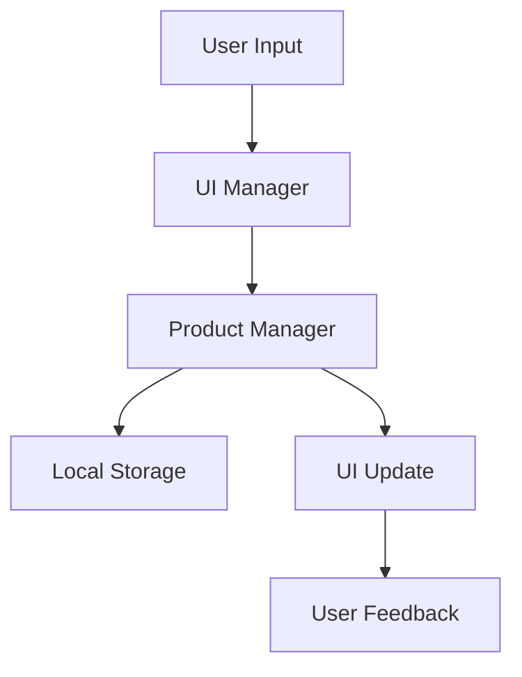

# Documentação Técnica - ShoeStock

## Arquitetura

### Módulos Principais

1. **products.js**
   - Gerenciamento de estado dos produtos
   - Validação de dados
   - Persistência local (localStorage)
   - Funções de filtro e busca

2. **ui.js**
   - Gerenciamento de interface
   - Sistema de feedback
   - Loading states
   - Renderização de componentes

3. **theme.js**
   - Gerenciamento de temas
   - Persistência de preferências
   - Alternância claro/escuro

### Fluxo de Dados



## Componentes

### Sistema de Upload de Imagens

```javascript
// Características principais:
- Drag and drop
- Preview em tempo real
- Validação de tipo e tamanho
- Feedback visual
- Remoção de imagem
```

### Listagem de Produtos

```javascript
// Funcionalidades:
- Ordenação
- Filtros
- Busca
- Edição inline
- Exclusão com confirmação
```

### Modal de Edição

```javascript
// Recursos:
- Preview de imagem atual
- Upload de nova imagem
- Validação em tempo real
- Feedback de sucesso/erro
```

## Padrões de Projeto

### Singleton
Usado em:
- UI Manager
- Product Manager
- Theme Manager

### Observer
Implementado para:
- Atualizações de UI
- Mudanças de tema
- Estado dos produtos

### Factory
Utilizado em:
- Criação de elementos UI
- Instanciação de produtos

## Validações

### Produtos
- Referência: string, obrigatório
- Marca: string, obrigatório
- Descrição: string, obrigatório
- Preço: número, obrigatório, > 0

### Imagens
- Tamanho: máx 5MB
- Tipos: jpg, jpeg, png, gif
- Dimensões: validadas no cliente

## Performance

### Otimizações Implementadas
- Debounce em buscas
- Throttle em eventos de scroll
- Lazy loading de imagens
- Cache de dados local

### Métricas Alvo
- First Paint: < 1s
- Time to Interactive: < 2s
- Lighthouse Score: > 90

## Segurança

### Implementado
- Sanitização de input
- Validação de tipos
- Proteção XSS
- Limite de upload

### Pendente
- CSRF Protection
- Rate Limiting
- Autenticação
- Autorização

## Testes (Planejado)

### Unit Tests
- Validações
- Transformações
- Utilitários

### Integration Tests
- Fluxo de produtos
- Upload de imagens
- Persistência

### E2E Tests
- Cadastro
- Edição
- Exclusão
- Listagem

## Roadmap Técnico

### Q1
- Implementar paginação
- Adicionar lazy loading
- Melhorar cache

### Q2
- Sistema de autenticação
- Testes automatizados
- CI/CD pipeline

### Q3
- PWA features
- Offline support
- Push notifications

### Q4
- Analytics
- A/B testing
- Performance monitoring
